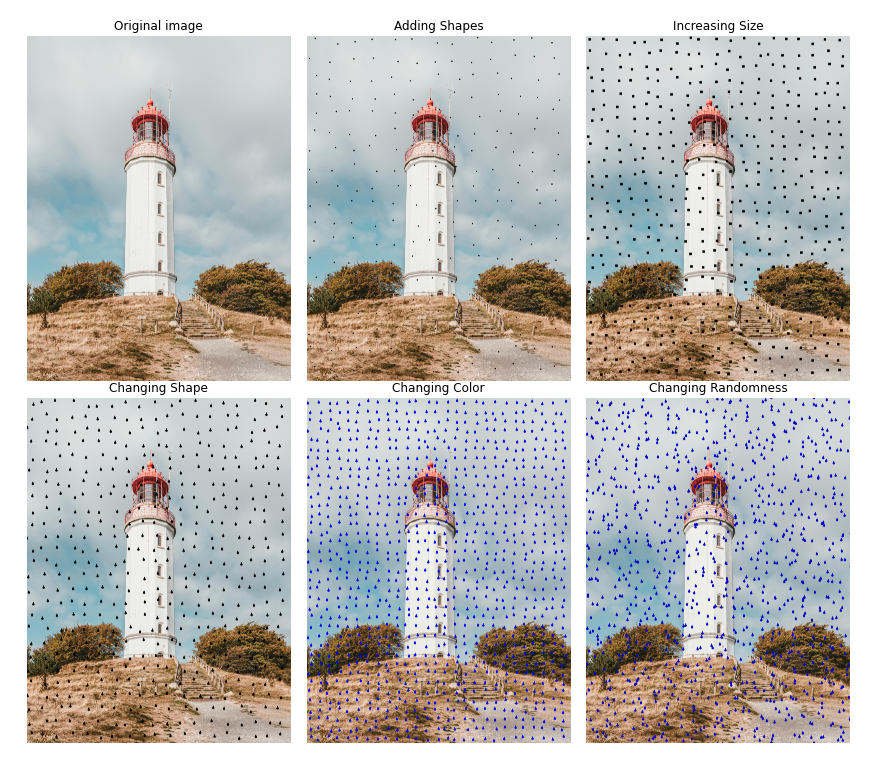

# PyOcclusion


PyOcclusion is a Python package for adding noise of occlusionary type to video files. There is a broad range of parameters for altering in order to achieve the desirded occlusion density, coverage percent, etc. The process is automated and requires no additional prescribing.

Here is an example of what can be done with PyOcclusion:



# Installation

PyOcclusion can be installed from PyPI:

```pip install PyOcclusion```

Once installed, package can be loaded as:

```import PyOcclusion```